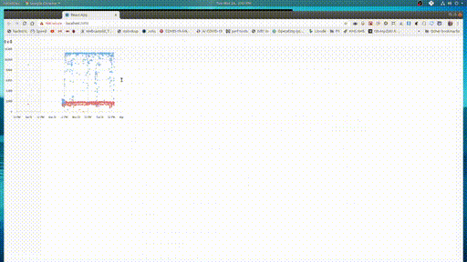

This project was bootstrapped with [Create React App](https://github.com/facebook/create-react-app).

This project is to test using react-chart.  Wanted a way to look at the data collected by speedtest-cli every 5 minutes.  Blue is Download Speeds 2-11Mps.
Red is Upload Speeds 0.5-1.5 Mps




### Note: the Box.js uses react-resize an wrapped around MyChart allows the graph to be enlarged.


## MyChart.js
```js
import React from 'react'
import Box from './Box'
import { Chart } from 'react-charts'

const MyChart = (props) => {

const series = React.useMemo(
  () => ({
    type: 'bubble',
    showPoints: false
  }),
  []
)
  const axes = React.useMemo(
    () => [
      {
        primary: true,
        position: 'bottom',
        type: 'time',
        show: true
      },
      { type: 'linear', position: 'left' }
    ],
    []
  )

  const lineChart = (<Box>
                      <Chart data={props.data} axes={axes}  series={series} tooltip />
                    </Box>)

  return lineChart
}


export default MyChart;
```
--------------------

where the App compnent creates the dataset (my current internet speeds)

## first part of App.js (creates the data set to graph)
```js

const mem = (s) => ( parseFloat(s) / 1000.0 )   // in k units not meg

const buildGraphData = (data) => {

  if (!data)
     return null

  const TIME = 3
  const DOWNLOAD = 6
  const UPLOAD = 7

  let start = 1
  let end = data.length - 1
  if (data[end].length < 10)  // each data row in the CSV has 10 columns
     end--                    // remove last line if blank

  data = data.slice(start,end)

  // convert the strings from the CSV file into numbers
  const down = data.map( (v, i) => [ new Date(v[TIME]), mem(v[DOWNLOAD]) ] )
  const up   = data.map( (v, i) => [ new Date(v[TIME]), mem(v[UPLOAD])   ] )

  return [
            {
              label: 'Download',
              data: down
            },
            {
              label: 'Upload',
              data: up
            }
        ];
}

```
## the rest of App.js
```js
const App = () => {

  const [status, data] = useCSV("./speedtest-cli.csv");
  const [graphData, setGraphData] = useState(null);

  useEffect(() => {
    const gDat = buildGraphData(data)
    setGraphData(gDat)
  }, [data]);

  if (status !== "Complete" || graphData === null)
    return <span>{status}</span>            // report Loading... or error

  return (
    <div>
      <MyChart data={graphData} />
    </div>
  );
}

export default App;
```

## Available Scripts

In the project directory, you can run:

### `yarn start`

